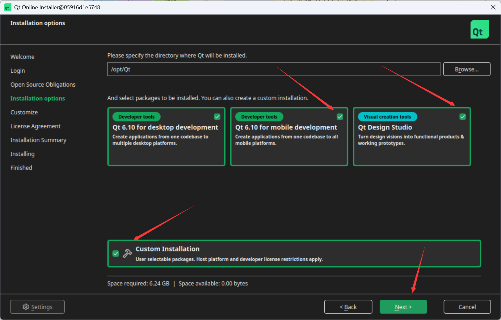

# 前言

在docker中搭建qt开发环境，用于运行slam算法

# 搭建过程

❇️下载qt安装文件

```shell
wget http://fishros.com/install -O fishros && bash fishros

unminimize 

apt-get update
apt install x11-xserver-utils libxcb* ffmpeg libavcodec-dev libavutil-dev libavformat-dev libswscale-dev -y
apt install libxcb-cursor0 libxcb-cursor-dev libglew-dev libboost-dev libboost-thread-dev libboost-filesystem-dev -y
apt install libpng-dev nasm libeigen3-dev libglfw3-dev -y
apt install gnome-panel gnome-settings-daemon metacity nautilus gnome-terminal ubuntu-desktop build-essential curl zip unzip tar -y

cd graph_executer/downloads
wget https://d13lb3tujbc8s0.cloudfront.net/onlineinstallers/qt-online-installer-linux-x64-4.10.0.run
chmod +x qt-online-installer-linux-x64-4.10.0.run
./qt-online-installer-linux-x64-4.10.0.run

# 创建软链接
ln -s /opt/Qt/Tools/QtCreator/bin/qtcreator /usr/bin/qtcreator

ln -s /opt/Qt/Tools/QtDesignStudio/bin/qtdesignstudio /usr/bin/qtdesignstudio
# 删除软链接
# rm -rf /usr/bin/qtcreator

# 设置图标放大倍数
# export QT_SCALE_FACTOR=1.5
echo "export QT_SCALE_FACTOR=1.5" >> ~/.bashrc
source ~/.bashrc
# qtcreator & # 加&表示后台运行
# 启动
qtcreator
```



有时候qml无法显示，可以重新启动Docker容器