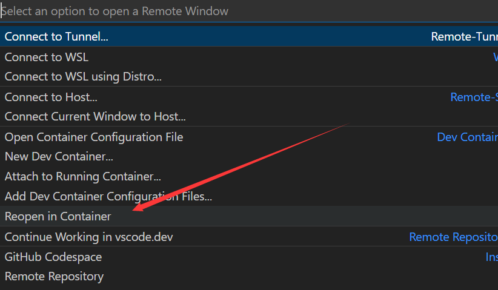

---

# 前言

为方便开发，本文介绍一种基于Docker容器的开发环境。

# 安装Docker-Desktop

# 创建`devcontainer.json`

```json
// For format details, see https://aka.ms/devcontainer.json. For config options, see the README at:
// https://github.com/microsoft/vscode-dev-containers/tree/v0.183.0/containers/ubuntu
{
    /* 显示在UI上的容器名称 */
    "name": "GraphExecuter",
    /* 容器注册表中的镜像名称 */
    "image":"docker.1ms.run/ubuntu:22.04",
    /* 加载本地的文件夹到镜像的/workspaces文件夹 */
    "workspaceMount": "source=${localWorkspaceFolder},target=/workspaces,type=bind",
    /* 容器内的工作空间文件夹路径，也就是说容器运行后打开的就是这个文件夹 */
    "workspaceFolder": "/workspaces/graph_executer",
    /* 当容器创建时所下载的VSCODE插件挂载到容器target的路径下，
            这样再rebuild容器时不用再次下载VSCODE插件
    */
    "mounts": [
        "source=extensionCache,target=/root/.vscode-server/extensions,type=volume",
    ],
    /* 根据Dockerfile的内容创建容器 */
    "build": {
        "dockerfile": "Dockerfile"
    },

    /* 选择容器在创建时，需要安装的插件 */
    "extensions": [
        "ms-vscode.cpptools",
    ],
    "runArgs": [
        "--pid=host",
        "-v", "/tmp/.X11-unix:/tmp/.X11-unix",
        "-p", "6080:80",
        "-p", "10000:10000",
        "-e", "DISPLAY=host.docker.internal:0.0",
        "-e", "PULSE_SERVER=host.docker.internal"
    ]
}

```

# 创建Dockerfile

```Dockerfile
	# 创建容器所需要的docker镜像，这里是ESP-IDF的镜像
	FROM docker.1ms.run/ubuntu:22.04
	# 执行命令时，不需要交互，直接运行
	ARG DEBIAN_FRONTEND=nointeractive

	RUN apt-get update \
	  && apt install -y -q \
	  cmake \
	  git \
	  python3 \
	  python3-pip \
	  wget

	ENTRYPOINT [ "/opt/esp/entrypoint.sh" ]

	CMD ["/bin/bash"]
```

# 重新打开



# 安装Anaconda3

```shell
cd downloads
wget https://repo.anaconda.com/archive/Anaconda3-2025.06-0-Linux-x86_64.sh

bash Anaconda3-2025.06-0-Linux-x86_64.sh 
# 都是yes或者回车

# 重新打开终端
conda create -n graph_executer python=3.12
conda activate graph_executer
```

# 安装相关依赖

```shell
# 在容器中，打开终端
pip3 config set global.index-url https://pypi.tuna.tsinghua.edu.cn/simple
pip3 install -r requirements_linux.txt
cd downloads
wget http://fishros.com/install -O fishros && . fishros # 安装ros2

# 在宿主机中，重新打开终端
cd downloads
git clone https://github.com/laoxue888/NodeGraphQt.git

# 在容器中，重新打开终端
cd downloads/NodeGraphQt
conda activate graph_executer
pip install -e .
```

# 运行

1、运行`MobaXterm`软件

2、运行以下脚本
```shell
conda activate graph_executer
python3 main.py
```