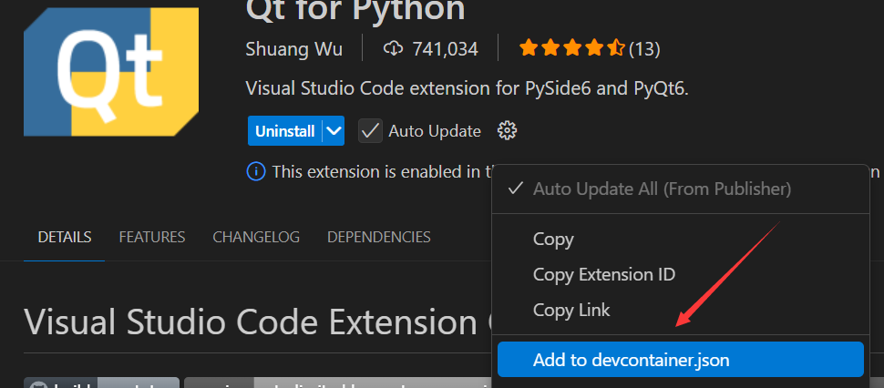
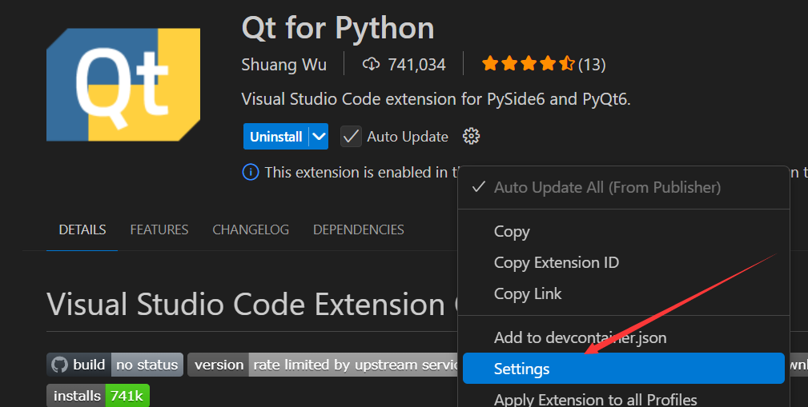
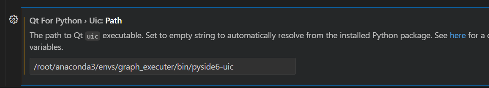
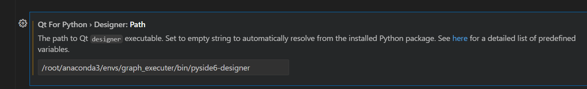

---


# 前言

配置第三方工具，方便编辑ui文件

# 配置

1、vscodea安装插件：Qt for Python

2、设置







```shell
/root/anaconda3/envs/graph_executer/bin/pyside6-uic
```



```shell
/root/anaconda3/envs/graph_executer/bin/pyside6-designer
```

# 参考  

- [ubuntu22.04 pyside6 vscode 安装与配置](https://blog.csdn.net/qq_38089394/article/details/136578957)