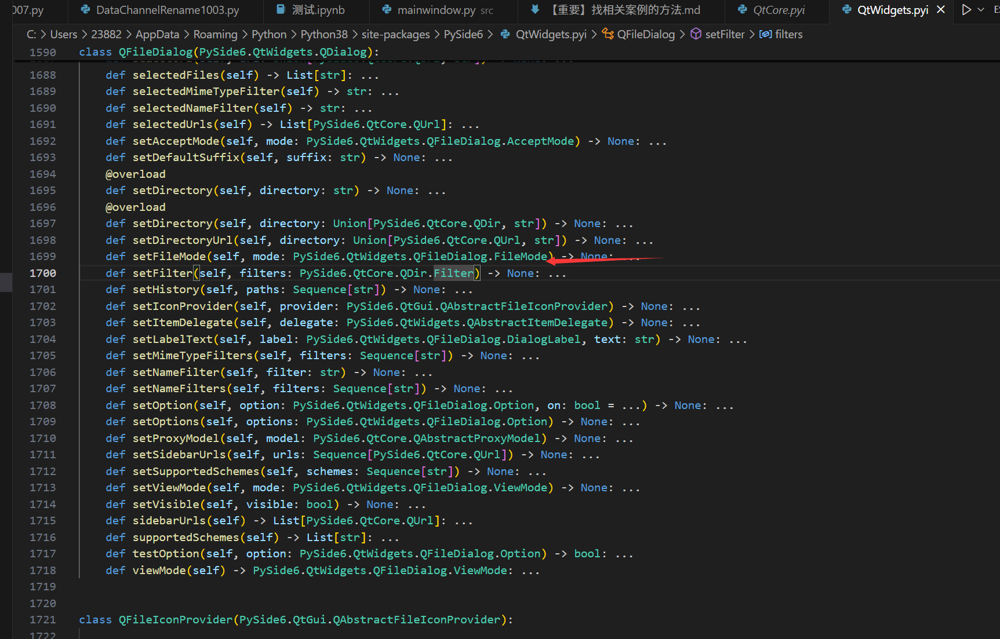
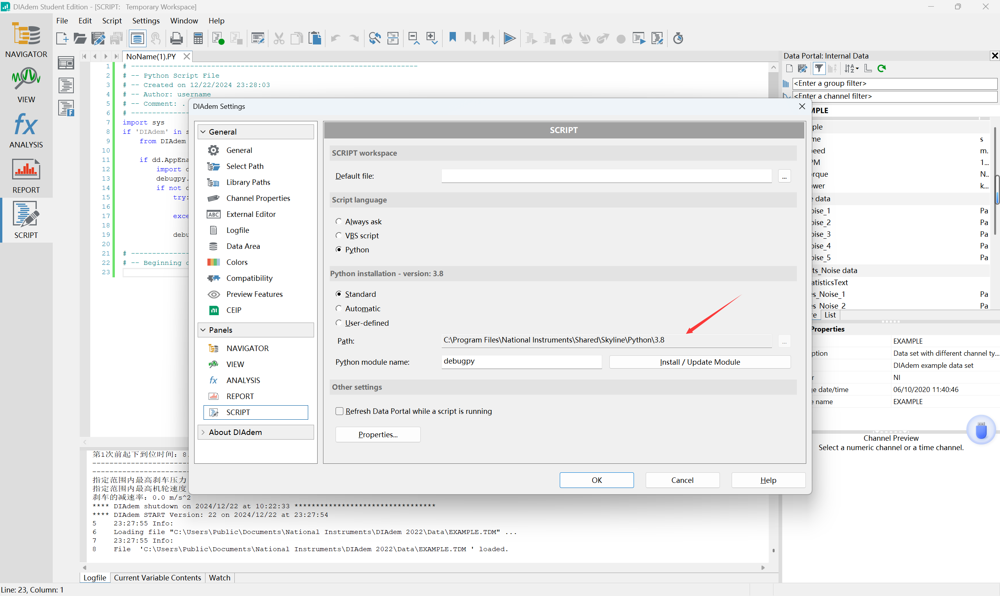

1、找模块的位置

进入方法里，可以看到类继承相关库。



2、PyQt较早发行，可以找到很多相关的案例。这些案例稍微改一下就适合PySide的使用。因此，搜索PySide的案例前，先参考PyQt的案例。


3、添加程序找模块的路径

```python
# 指定要添加的文件夹，使用os.path.join()函数以正确的方式构造文件名
import sys
from os import path
def add_path_to_sys_path(folder_path):
    # 将文件夹添加到sys.path中
    if folder_path not in sys.path:
        sys.path.append(folder_path)

# 添加文件夹作为模块搜索路径
prj_dir = r'E:\AVIC\1_TestFlight\DataAnalysisTemplate\程序\DataProcessUI'
folders = [os.path.join(prj_dir, 'src'), 
           os.path.join(prj_dir, 'renamedata'),
           os.path.join(prj_dir, 'ui'),
           os.path.join(prj_dir, 'utils'),
           os.path.join(prj_dir, 'logs'),
           os.path.join(prj_dir, 'settings'),]

for folder in folders:
    for root, dirs, files in os.walk(folder):
        # print(f"Directory: {root}")
        add_path_to_sys_path(root)
        for dir in dirs:
            # print(f"  Subdirectory: {dir}")
            add_path_to_sys_path(dir)

```

# 运行环境位置

