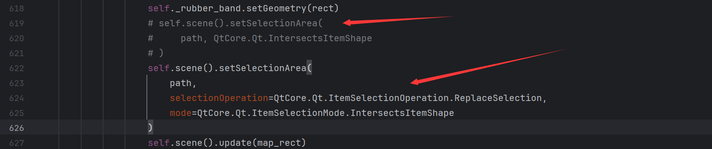

---

[TOC]

# GraphExecuter使用手册

## 前言

**软件功能：**


# 报错

❌ 报错信息：

运行`mkdocs build`时报错：

```shell
Fatal error in launcher: Unable to create process using '"D:\ProgramData\anaconda3\envs\diadem_ui\python.exe"
```

✔️

```shell
python -m pip install -U --force-reinstall mkdocs
```

❌

```shell
Error calling Python override of QGraphicsView::mouseMoveEvent(): Traceback (most recent call last):
  File "D:\ProgramData\anaconda3\envs\DataProcessUI\Lib\site-packages\NodeGraphQt\widgets\viewer.py", line 619, in mouseMoveEvent
    self.scene().setSelectionArea(
TypeError: 'PySide6.QtWidgets.QGraphicsScene.setSelectionArea' called with wrong argument types:
  PySide6.QtWidgets.QGraphicsScene.setSelectionArea(QPainterPath, ItemSelectionMode)
Supported signatures:
  PySide6.QtWidgets.QGraphicsScene.setSelectionArea(path: PySide6.QtGui.QPainterPath, /, selectionOperation: PySide6.QtCore.Qt.ItemSelectionOperation = Instance(Qt.ReplaceSelection), mode: PySide6.QtCore.Qt.ItemSelectionMode = Instance(Qt.IntersectsItemShape), deviceTransform: PySide6.QtGui.QTransform = Default(QTransform))
  PySide6.QtWidgets.QGraphicsScene.setSelectionArea(path: PySide6.QtGui.QPainterPath, deviceTransform: PySide6.QtGui.QTransform, /)
```

✔️Pyside6和nodegraphqt版本不适配导致，更改以下位置即可：



```shell
# "D:\ProgramData\anaconda3\envs\XXXXXXXX\Lib\site-packages\NodeGraphQt\widgets\viewer.py"

# self.scene().setSelectionArea(
#     path, QtCore.Qt.IntersectsItemShape
# )
self.scene().setSelectionArea(
    path,
    selectionOperation=QtCore.Qt.ItemSelectionOperation.ReplaceSelection,
    mode=QtCore.Qt.ItemSelectionMode.IntersectsItemShape
)
```