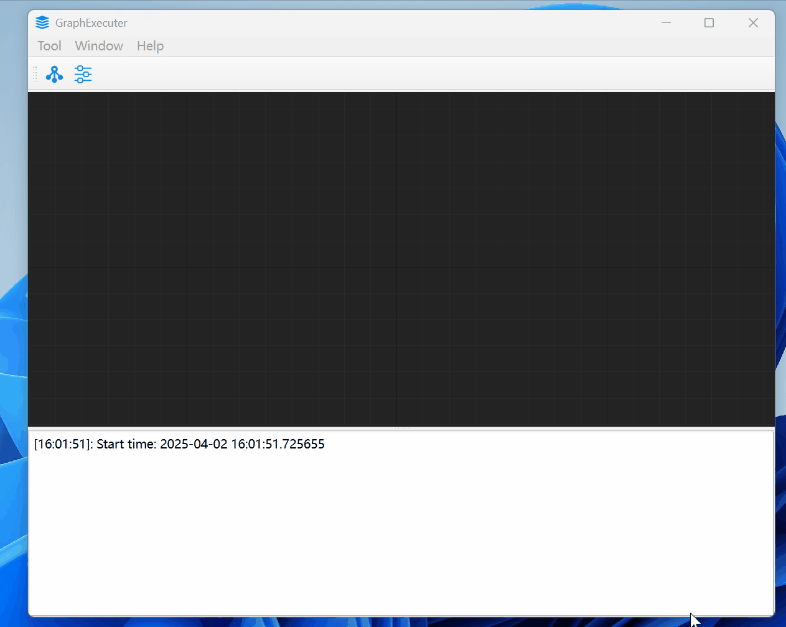
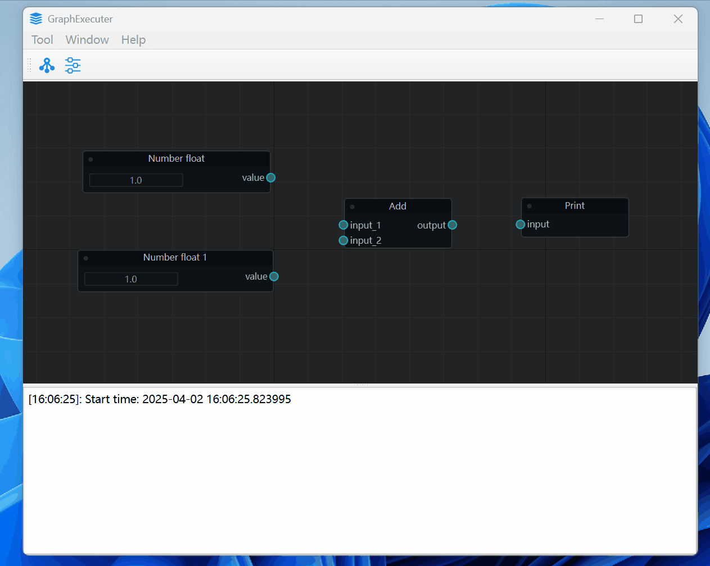
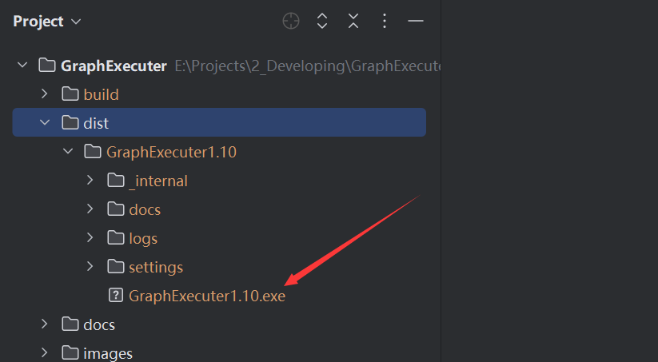

## 前言（Introduction）

GraphExecuter 是一款基于 NodeGraphQt 开发的开源软件，采用 多线程图执行 架构，用户只需编写节点逻辑并通过连线构建图，即可自动调度并运行复杂的工作流。

该系统结合了 可视化节点编辑 和 高效并行计算，适用于数据处理、自动化任务、分布式计算等场景。开发者无需关心线程管理，只需专注于节点功能的实现，即可快速搭建高性能工作流。GraphExecuter 为需要 灵活、可扩展、可视化编排 的用户提供了便捷的解决方案，适用于从实验到生产的各种需求。


code: [https://github.com/laoxue888/GraphExecuter](https://github.com/laoxue888/GraphExecuter)

video:

- [2025-4-17: 开源DeepSeek人工智能语音对话工作流，你的AI智能语音助手啦](https://www.bilibili.com/video/BV1e15qz7ESi/?vd_source=3bf4271e80f39cfee030114782480463)
- [2025-4-2: 高效创建工作流，可实现类似unreal engine的蓝图效果，内部使用多线程高效执行节点函数](https://www.bilibili.com/video/BV1PkfKY1Esk/?vd_source=3bf4271e80f39cfee030114782480463)


## 开发环境搭建

```shell
pip install -r .\requirements.txt

## 强制重新安装模块
pip install --force-reinstall --no-cache-dir pyside6
```

## 运行

```shell
python main.py
```
❇️按`Tab`创建节点



❇️连接节点




## 编译

```shell
./compile.bat
```



生成的可执行文件存放在`dist`文件夹下

## 报错

❌框选节点的时候报错

```shell
Error calling Python override of QGraphicsView::mouseMoveEvent(): Traceback (most recent call last):
  File "D:\ProgramData\anaconda3\envs\DataProcessUI\Lib\site-packages\NodeGraphQt\widgets\viewer.py", line 619, in mouseMoveEvent
    self.scene().setSelectionArea(
TypeError: 'PySide6.QtWidgets.QGraphicsScene.setSelectionArea' called with wrong argument types:
  PySide6.QtWidgets.QGraphicsScene.setSelectionArea(QPainterPath, ItemSelectionMode)
Supported signatures:
  PySide6.QtWidgets.QGraphicsScene.setSelectionArea(path: PySide6.QtGui.QPainterPath, /, selectionOperation: PySide6.QtCore.Qt.ItemSelectionOperation = Instance(Qt.ReplaceSelection), mode: PySide6.QtCore.Qt.ItemSelectionMode = Instance(Qt.IntersectsItemShape), deviceTransform: PySide6.QtGui.QTransform = Default(QTransform))
  PySide6.QtWidgets.QGraphicsScene.setSelectionArea(path: PySide6.QtGui.QPainterPath, deviceTransform: PySide6.QtGui.QTransform, /)
```

✔️Pyside6和nodegraphqt版本不适配导致，更改`viewer.py`以下位置即可：

```shell
# "D:\ProgramData\anaconda3\envs\XXXXXXXX\Lib\site-packages\NodeGraphQt\widgets\viewer.py"

# self.scene().setSelectionArea(
#     path, QtCore.Qt.IntersectsItemShape
# )
self.scene().setSelectionArea(
    path,
    selectionOperation=QtCore.Qt.ItemSelectionOperation.ReplaceSelection,
    mode=QtCore.Qt.ItemSelectionMode.IntersectsItemShape
)
```

## 参考

> - [NodeGraphQt](https://github.com/jchanvfx/NodeGraphQt)
> - [NodeGraphQt Documentation](https://chantonic.com/NodeGraphQt/api/index.html)
